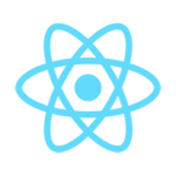

### Hi there, I am José Augusto Machoski

- 🎓 &nbsp; Student of **Analysis and Development of Systems** at <a href="https://www.unicesumar.edu.br/home/">Unicesumar</a>
- 💼 &nbsp; Working as **Developer Intern** at <a href="https://alexandria.solar/">Alexandria</a>
- 🌱 &nbsp; I’m currently focused on learn ReactJS

## GitHub status

## Contact

&nbsp;

&nbsp;

&nbsp;

 

# Skills
## Languages and Frameworks

  
  
  
  
  
  

## Tools

  
  
  
  
  
  

## DevOps

  
  
  

